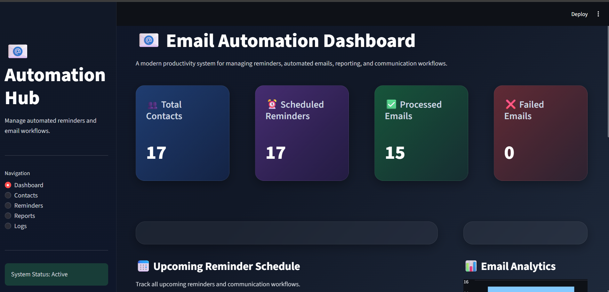

# 📧 Email Automation & Reminder System

A modern Python-based Email Automation & Reminder System built using **Python**, **Streamlit**, **SMTP**, and **Pandas**.

This project automates reminder emails, follow-up notifications, and communication workflows using CSV data and personalized email templates. It also includes a professional Streamlit dashboard for monitoring reminders, reports, analytics, and logs.

---

## 🚀 Features

- Automated Email Sending
- Reminder Scheduling
- CSV-based Contact Management
- Personalized Email Templates
- Streamlit Dashboard
- Email Reports & Analytics
- Logging System
- Dry Run Testing Mode

---

## 🛠️ Tech Stack

- Python
- Streamlit
- Pandas
- SMTP
- dotenv
- Logging

---

## ▶️ Run Project

### Install Dependencies

```bash
pip install -r requirements.txt
```

### Run Automation System

```bash
python main.py
```

### Run Streamlit Dashboard

```bash
streamlit run streamlit_app.py
```

---

## 📊 Dashboard Preview



---

## 📂 Project Structure

```text
Email-Automation-Reminder-System/
│
├── data/
├── templates/
├── outputs/
├── logs/
├── src/
├── images/
├── main.py
├── streamlit_app.py
└── README.md
```

---

## 👩‍💻 Author

**Shravani Sahare**
